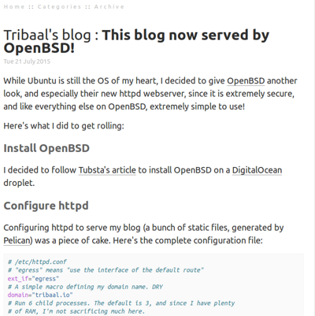

tribaal-mnmlist
################

This is tribaal's fork of the `mnmlist theme <http://mnmlist.com/theme>`_ adapted for Pelican.

It's very similar to the mnmlist theme, but uses the Ubuntu fonts where applicable.

Screenshot
----------

Example
--------

If you want to see it live, feel free to have a look at my `personal blog <https://tribaal.io>`_.

Settings
--------

There's one additional setting used by this theme, if present:

::

    HIDE_DATE = False

If ``HIDE_DATE`` is set to ``True``, dates won't be displayed under the blog post titles.

Compass
--------

The ``main.css`` file is generated from the ``compass/src/main.scss`` sass file, using http://compass-style.org/.

To regenerate CSS on Ubuntu, install the "ruby-compass" package, then run "cd compass; compass compile; cd .."
